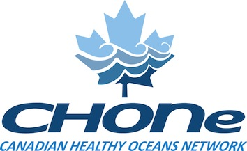

CHONe (Canadian Healthy Oceans Network):  Notes from CHONe's Data Management Underground
========================================================
author: Kate Crosby, Michelle Lloyd, and Peter Lawton
font-import: http://fonts.googleapis.com/css?family=Lato
font-family: 'Lato'
date: March  18, 2014  


Talk Outline
========================================================

***
- Brief background of CHONe (size, scope, type of data)
- Handy tools for metadata collection
- Handy tools for making data public


The size and scope of data within CHONe
========================================================
- 60 researchers from institutions across Canada 

- Positions range from Gov't scientists, to undergraduate students 

- Each with 1-4 active research projects depending on position 

- Dates of projects range from 2007-2013, but some continue on...

First challenge: What are the data?
========================================================


Slide With Code
========================================================


```r
summary(cars)
```

```
     speed           dist    
 Min.   : 4.0   Min.   :  2  
 1st Qu.:12.0   1st Qu.: 26  
 Median :15.0   Median : 36  
 Mean   :15.4   Mean   : 43  
 3rd Qu.:19.0   3rd Qu.: 56  
 Max.   :25.0   Max.   :120  
```


Slide With Plot
========================================================

 

