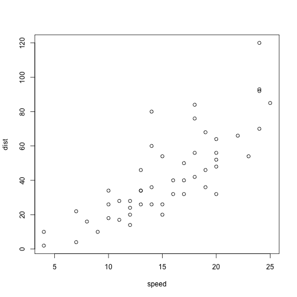

CHONe (Canadian Healthy Oceans Network):  Notes from CHONe's Data Management Underground
========================================================
author: Kate Crosby, Michelle Lloyd, and Peter Lawton
font-import: http://fonts.googleapis.com/css?family=Lato
font-family: 'Lato'
date: March  18, 2014  


Talk Outline
========================================================

***
- Brief background of CHONe (size, scope, types of data, problems)
- Handy tools for metadata collection
- Handy tools for making data public


The size and scope of data within CHONe
========================================================
type: section
incremental: true

- 60 researchers from institutions across Canada 

- Positions range from Gov't scientists, to undergraduate students 

- Each with 1 - 4 active research projects depending on position 

- Dates of projects range from 2007 - 2013, but some continue on...

Is making a database with a common schema possible? What are the data?
========================================================

Common schema(s) = e.g. BOLD (Barcode of Life Data systems), NCBI (Genbank), OTN (Ocean Tracking network).

Long answer is: yes possibly, we could introduce __many, many, different schemas__

Short answer is: __NO__

Why is this not easily possible?

CHONe's data & datatypes are vast like the 3 oceans they span 
=======================================================
incremental: true
- Much diversity, with some overlap, but no one (or a few) common schema
- Making a useful table (like with MS-Access) with a fasta file and CTD data would be __impossible__ or __meaningless__


What data or metadata would be useful for DFO, the public, and CHONe?
=======================================================
type:section
* __Broad GPS coordinates for mapping purposes__
* __Species under study__
* __Time period of study__
* __Titles of publications relating to study__

Challenge: How to get at all this data in a meaningful way?
=======================================================
* __Metadata collection w/ Survey forms__
  * E.g. google (free), survey monkey (free), or custom one with more padded security features
  * Design is user-friendly, but back-end can be scraped automatically with R
  * With Google forms, you can enable basic permissions to the __"right"__ user levels

* __Google__ __form__ __used:__
  * [CHONe metadata collection] (https://docs.google.com/forms/d/1zkTYqeax_w1d-VnE6oojfA2w4ed6x4APtwFfb9wonhI/edit)

Results of survey form <small>(with dutiful pestering from Michelle Lloyd and Joan Atkinson)</small>
======================================================
*

Slide With Code
========================================================


```r
summary(cars)
```

```
     speed           dist    
 Min.   : 4.0   Min.   :  2  
 1st Qu.:12.0   1st Qu.: 26  
 Median :15.0   Median : 36  
 Mean   :15.4   Mean   : 43  
 3rd Qu.:19.0   3rd Qu.: 56  
 Max.   :25.0   Max.   :120  
```


Slide With Plot
========================================================

 

