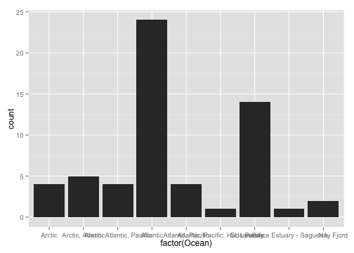

CHONe (Canadian Healthy Oceans Network):  Notes from CHONe's Data Management Underground
========================================================
author: Kate Crosby, Michelle Lloyd, and Peter Lawton
font-import: http://fonts.googleapis.com/css?family=Lato
font-family: 'Lato'
date: March  18, 2014  


Talk Outline
========================================================
left:40%

***
- Brief background of CHONe (size, scope, types of data, problems)
- Handy tools for metadata collection
- Handy tools for making data public


The size and scope of data within CHONe
========================================================
type: section
incremental: true

- 60 researchers from institutions across Canada 

- Positions range from Gov't scientists, to undergraduate students 

- Each with 1 - 4 active research projects depending on position 

- Dates of projects range from 2007 - 2013, but some continue on...

Is making a database with a common schema possible? What are the data?
========================================================

Common schema(s) = e.g. BOLD (Barcode of Life Data systems), NCBI (Genbank), OTN (Ocean Tracking network).

Long answer is: yes possibly, we could introduce __many, many, different schemas__

Short answer is: __NO__

Why is this not easily possible?

CHONe's data & datatypes are vast like the 3 oceans they span 
=======================================================
incremental: true
- Much diversity, with some overlap, but no one (or a few) common schema
- Making a useful table (like with MS-Access) with a fasta file and CTD data would be __impossible__ or __meaningless__


What data or metadata would be useful for DFO, the public, and CHONe?
=======================================================
type:section
* __Broad GPS coordinates for mapping purposes__
* __Species under study__
* __Time period of study__
* __Titles of publications relating to study__

Challenge: How to get at all this data in a meaningful way?
=======================================================
incremental:true
* __Metadata collection w/ Survey forms__
  * E.g. google (free), survey monkey (free), or custom one with more padded security features
  * Design is user-friendly, but back-end can be scraped automatically with R
  * With Google forms, you can enable basic permissions to the __"right"__ user levels

* __Google__ __form__ __used:__
  * [CHONe metadata collection] (https://docs.google.com/forms/d/1zkTYqeax_w1d-VnE6oojfA2w4ed6x4APtwFfb9wonhI/viewform)

METADATA MANIPULATION
======================================================
type:section
* View quick analytics in google 
* Import to R (RStudio - Nice IDE)
* Implement version control to easily track changes and versions
  * Git (local), and github (online repository)

Results of survey form 
======================================================
* Results from the form are stored as a spreadsheet
  * [Familiar file type] (https://docs.google.com/spreadsheet/ccc?key=0AmsZcgcljAoodGhHaExkZlU1dHhtUkpnb0UtOEJ4THc&usp=drive_web#gid=0)
  * [Summary display] (https://docs.google.com/forms/d/1ww045eN0tqW6dUibyGAcZ2ubAKWyV-gXserLhaiZBgk/viewanalytics)
* Easy to import the data into R, for manipulation


```r
library(mosaic)

CHONedataweb<- fetchGoogle("https://docs.google.com/spreadsheet/ccc?key=0AmsZcgcljAoodGhHaExkZlU1dHhtUkpnb0UtOEJ4THc&usp=drive_web#gid=0")

CHONedatacsv <- fetchGoogle("https://docs.google.com/spreadsheet/pub?key=0AmsZcgcljAoodGhHaExkZlU1dHhtUkpnb0UtOEJ4THc&single=true&gid=0&output=csv")

```


Output of XML and CSV, respectively
========================================================


```
'data.frame':	39 obs. of  1 variable:
 $ X.html..head..meta.http.equiv.content.type.content.text.html..charset.UTF.8.: Factor w/ 33 levels "     .bodytext {font-size: 83%;}",..: 25 30 21 7 6 14 12 13 8 4 ...
```

```
            Timestamp FirstName LastName.             Role
1   9/18/2013 6:03:37  Michelle     Lloyd Graduate student
2  9/23/2013 12:26:44      Remi    Daigle Graduate student
3  11/3/2013 11:54:26      Anna   Metaxas  PI, Themeleader
4 11/12/2013 20:33:28  Chih-Lin       Wei          Postdoc
5  11/13/2013 9:21:51    Renald    Belley Graduate student
6 11/15/2013 11:10:46    Ashley     Robar Graduate student
           Institution                 Email
1 Dalhousie University michelle.lloyd@dal.ca
2 Dalhousie University    remi.daigle@dal.ca
3 Dalhousie University        metaxas@dal.ca
4  Memorial University     chihlinwei@mun.ca
5  Memorial University  renald.belley@mun.ca
6  Memorial University        anrobar@mun.ca
                                                                                                                                                                                                                                                                                                                                                                                                                   Publications
1                                                     Physical and biological factors affect the vertical distribution of larvae of benthic gastropods in a shallow embayment\nPatterns in vertical distribution and their potential effects on transport of larval benthic invertebrates in a shallow embayment\nPatterns in the larval vertical distribution of marine benthic invertebrates in a shallow coastal embayment\n
2 Modelling of the larval response of green sea urchins to thermal stratification using a random walk approach\nVertical distribution of marine invertebrate larvae in response to thermal stratification in the laboratory\nFINE-SCALE DISTRIBUTION AND SPATIAL\nVARIABILITY OF BENTHIC INVERTEBRATE LARVAE \nBAY-SCALE PATTERNS IN THE DISTRIBUTION,\nAGGREGATION AND SPATIAL VARIABILITY OF LARVAE OF\nBENTHIC INVERTEBRATES
3                                                                                                                                                                  Physical and biological factors affect the vertical distribution of larvae of benthic gastropods in a shallow embayment\nPatterns in vertical distribution and their potential effects on transport of larval benthic invertebrates in a shallow embayment\n
4                                                                                                                                                                                                                                                                                                                                                   Meta-Analysis of Benthic communities in shallow coastal habitat in Canada\n
5   - Benthic biodiversity and ecosystem functioning in the Gulf of Maine\n- Benthic biodiversity and ecosystem functioning in Saanich Inlet and the Strait of Georgia\n- Benthic biodiversity and ecosystem functioning in the Barkley Canyon\n- Effect of oxygen concentration on benthic biodiversity and ecosystem functioning\n- Effect of simulated phytoplankton bloom on benthic biodiversity and ecosystem functioning
6                                                                                                                                                  1) The role of environmental factors in determining biodiversity spatial patterns in deep-water Gulf of Maine sedimentary benthos.\n\n2) Spatial patterns in ecosystem functions throughout the Gulf of Maine: Investigation of biodiversity impacts on ecosystem functions.
                  FieldLabSimulation    MinLat    MaxLat     MinLong
1                              Field    45.783    45.783    -61.7777
2 Field, Lab, Simulation/Theoretical  45.71147  46.05218   -61.88518
3                              Field    45.783    45.783    -61.7777
4                      Meta Analysis      <NA>      <NA>        <NA>
5                              Field 41.290556 49.084167 -129.108611
6                              Field   42.4094   43.5761    -64.9886
     MaxLong                     Ocean
1   -61.7777                  Atlantic
2  -61.57103                  Atlantic
3   -61.7777                  Atlantic
4       <NA> Arctic, Atlantic, Pacific
5 -65.146111         Atlantic, Pacific
6   -67.4431                  Atlantic
                                        Year
1                                       2009
2                           2008, 2009, 2010
3                                       2009
4 historical data from various sampling year
5                           2010, 2011, 2013
6                                       2009
                               Month
1                             August
2                             August
3                       July, August
4                               <NA>
5 May, June, July, August, September
6                       July, August
                                                                                                                                                                                                                                                       Data.Title
1                                                                                                                                                                                 Vertical distribution measurements of meroplanktonic larvae and the environment
2                                                                                                  meroplankton adundances with oceanographic data\nvertical distribution of larvae in response to thermoclines\ntemperature dependent larval swimming velocities
3                                                                                                                                                                                                                             Meroplankton and oceanographic data
4                                                                                                                                                                                                                               Benthic macrofauna diversity data
5                                                                                                                                                                       Macrofauna, respiration, nutrient fluxes, sediment characteristics and oceanographic data
6 1) Macrofauna and polychaete community patterns/biodiversity measures (abundance, diversity, richness, evenness) with environmental data.\n\n2) Polychaete biodiversity measures (abundance, diversity, richness, evenness) with ecosystem function proxy data.
                                                                                                                                                                                                                                                                                                                                                                                                                                                                                                                                                                                                                                                                                                                                                                                                                                                                                                                                                                                                                                                                                                                                                                                                                                                                                                                                                                                                                                                                                                                                                                                                                                                                                                                                                                                                                                                                                                                                                                                                                                                                                                                                                                                                                                                                                                                                                                                                                                                                                                                                                                                                                                                       SpeciesTaxa
1                                                                                                                                                                                                                                                                                                                                                                                                                                                                                                                                                                                                                                                                                                                                                                                                                                                                                                                                                                                                                                                                                                                                                                                                                                                                                                                                                                                                                                                                                                                                                                                                                                                                                                                                                                                                                                                                                                                                                                                                                                                                                                                                                                                                                                                                                                                                                                                                                        Margarites spp. \nCrepidula spp.\nAstyris lunata\nDiaphana minuta\nLittorinimorpha\nArrhoges occidentalis\nIlyanassa spp.\nBittiolum  alternatum\nNudibranchia\nGastropoda\nBivalvia\nBryozoa\nBrachyura\nPolychaeta\nCaridea\nAsteroidea
2                                                                                                                                                                                                                                                                                                                                                                                                                                                                                                                                                                                                                                                                                                                                                                                                                                                                                                                                                                                                                                                                                                                                                                                                                                                                                                                                                                                                                                                                                                                                                                                                                                                                                                                                                                                                                                                                                                                                                                                                                                                                                                                                                                                                                                                                           Strongylocentrotus droebachiensis\nAsterias rubens\nArgopecten irradians\nElectra pilosa\nMembranipora membranacea\nMytilus spp.\nModiolus modiolus\nAnomia simplex\nBivalvia\nMargarites spp.\nAstyris lunata\nDiaphana minuta\nCrepidula spp.\nArrhoges occidentalis\nBittiolum alternatum\nGastropoda\nCancer irroratus\nCrangon septemspinosa\nNeopanopeus sayi\nCarcinus maenas\n
3                                                                                                                                                                                                                                                                                                                                                                                                                                                                                                                                                                                                                                                                                                                                                                                                                                                                                                                                                                                                                                                                                                                                                                                                                                                                                                                                                                                                                                                                                                                                                                                                                                                                                                                                                                                                                                                                                                                                                                                                                                                                                                                                                                                                                                                                                                                                                                                                                        Margarites spp. \nCrepidula spp.\nAstyris lunata\nDiaphana minuta\nLittorinimorpha\nArrhoges occidentalis\nIlyanassa spp.\nBittiolum  alternatum\nNudibranchia\nGastropoda\nBivalvia\nBryozoa\nBrachyura\nPolychaeta\nCaridea\nAsteroidea
4                                                                                                                                                                                                                                                                                                                                                                                                                                                                                                                                                                                                                                                                                                                                                                                                                                                                                                                                                                                                                                                                                                                                                                                                                                                                                                                                                                                                                                                                                                                                                                                                                                                                                                                                                                                                                                                                                                                                                                                                                                                                                                                                                                                                                                                                                                                                                                                                                                                                                                                                                                                                                                                       >1000 taxa
5                                                                                                                                                                                                                                                                                                                                                                                                                                                                                                                                                                                                                                                                                                                                                                                                                                                                                                                                                                                                                                                                                                                                                                                                                                                                                                                                                                                                                                                                                                                                                                                                                                                                                                                                                                                                                                                                                                                                                                                                                                                                                                                                                                                                                                                                                                                                                                                                                                                                                                                                                                                                         Not available at the moment (the list will be very long)
6 Aricidea nolani\nAricidea quadrilobata\nParaonidae spp A\nAricidea (Allia) sp A\nAricidea sp A\nParaonidae spp B\nLevinsenia sp A\nParaonidae spp C\nParaonidae spp D\nCossura longocirrata\nParamphinome jeffreysii\nSternaspis scutata\nNephtys incisa\nAglaophamus circinata\nPseudoscalibregma parvum\nLipobranchius sp A\nScalibregma inflatum\nScalibregmatidae spp A\nAmpharete finmarchica\nAmpharetidae spp A\nAmpharetidae spp B\nAuchenoplax crinita\nAmpharete sp A\nAmage auricula\nAnobothrus gracilis\nArtacama proboscidea\nStreblosoma sp A\nPista sp A\nLysilla loveni\nTerebellidae spp A\nStreblosoma sp B\nStreblosoma sp C\nPolycirrinae spp A\nLeaena sp\nAmphitrite sp A\nPolycirrus sp A\nTerebellides stroemii\nTrichobranchus gracialis\nTrichobranchidae spp A\nCapitellidae spp A\nCapitellidae spp B\nCapitellidae spp C\nCapitellidae spp D\nCapitellidae spp E\nCapitellidae spp F\nCapitellidae spp G\nCapitellidae spp H\nCapitellidae spp I\nCapitellidae spp J\nAncistrosyllis groenlandica\nPilargidae spp A\nSabellidae spp A\nJasmineria sp A\nEuchone incolor\nSabellidae spp B\nSabellidae spp C\nEuchone sp A\nScoloplos sp A\nDorvilleidae spp A\nMeiodorvillea minuta\nProtodorvillea sp A\nDorvilleidae spp B\nAberranta sp A\nSphaerodoropsis sp A\nSphaerodorium sp A\nSphaerodoridium sp A\nSphaerodoropsis sp B\nSphaerodoridae spp A\nSphaerodoropsis longipalpa\nChaetozone anasimus\nAphelochaeta sp A\nTharyx sp A\nCirratulidae spp A\nTharyx sp B\nMonticellina sp A\nCirratulidae spp B\nGlycera sp A\nGlycera sp B\nStreptosyllis sp A\nExogone (Exogone) verugera\nProsphaerosyllis sp A\nSyllidae spp A\nAphroditidae spp A\nLumbrineris sp A\nLumbrineris sp B\nLumbrineris sp C\nLumbrineris sp D\nLumbrineris sp E\nLumbrineris fragilis\nLumbrineris sp F\nNinoë sp A\nMaldanidae spp A\nMaldanidae spp B\nMaldanidae spp C\nMaldanidae spp D\nMaldanidae spp E\nMaldanidae spp F\nMaldanidae spp G\nMaldanidae spp H\nMaldanidae spp I\nMaldanidae spp J\nMaldanidae spp K\nMaldanidae spp L\nMaldanidae spp M\nMaldanidae spp N\nPrionospio sp A\nSpiophanes kroyeri\nSpiophanes sp A\nSpionidae spp A\nBrada villosa\nBrada inhabilis\nDiplocirrus longisetosus\nNereimyra sp A\nHesionidae spp A\nEunoe sp A\nAntinoella sp A\nPholoe sp A\nPholoe sp B\nMetaxypsamma sp A\nCeratocephale sp A\nNereididae spp A\nCeratocephale loveni\nNereididae spp B\nPhyllodoce sp A\nPhyllodoce sp B\nPhyllodocidae spp A\nPhyllodocidae spp B\nApistobranchus sp A\nOphelina sp A\nDysponetus pygmaeus\nGalathowenia sp A\nGalathowenia sp B\nUncispionidae spp A\nTrochochaeta sp A\nSerpulidae spp A
                                                                                                                                                                                                                                                                                    Tags.
1 Vertical migration, Vertical Distribution, Temperature, Fluorescence, Current velocity, Surface light intensity, Lunar phase, Diel period, Tidal state, Water column structure, stratification, Larval behavior, Larval transport, Biophysical model parameters, Coastal embayment, bay
2                       Benthic invertebrates\nLarval behaviour\nThermocline\nVertical distribution\nBio-physical model\nLarval dispersal\nRandom walk model\nVertical migration\nLarval aggregation\nSpatial patchiness\nAggregation-diffusion model\nSpatial scale\nSpatial variability
3                                                                                                                       "Vertical Distribution", "Temperature", "Fluorescence", "Current velocity", "Lunar phase", "Diel period", "Tidal state",  "Larval transport", "Coastal embayment"
4                                                                                                                                                                                                         diversity, benthos, community structure, species turnover, species distribution
5                                                                                                                                                                                                                Benthic, biodiversity, ecosystem function, hypoxia, organic matter input
6                                                                                                       "macrofauna'', "biodiversity", "ecosystem functions", "spatial patterns", "environmental factors", "Gulf of Maine", "benthos", "soft-sediment", "drivers", "ecosystem engineers".
                                                                                                                                                            Remarks
1                                                                                                                                                                  
2                                                                                                                                                                  
3 I didn't do all subprojects because it will take me 40 min (which I do nor have) and I am not sure whether this is just a trial. I only did CHONe_PC-06_LLOYDM\n 
4                                                                                                                                                                  
5                                                                                                                                                                  
6                                                                                                                                                                  
  MoreSurveys.
1          Yes
2          Yes
3          Yes
4          Yes
5          Yes
6          Yes
```


Moving forward with the csv look at Species/Taxa lists
========================================================


```r
species <- CHONedatacsv$SpeciesTaxa

## \n simply indicates separation between taxa
head(species)
```

```
[1] Margarites spp. \nCrepidula spp.\nAstyris lunata\nDiaphana minuta\nLittorinimorpha\nArrhoges occidentalis\nIlyanassa spp.\nBittiolum  alternatum\nNudibranchia\nGastropoda\nBivalvia\nBryozoa\nBrachyura\nPolychaeta\nCaridea\nAsteroidea                                                                                                                                                                                                                                                                                                                                                                                                                                                                                                                                                                                                                                                                                                                                                                                                                                                                                                                                                                                                                                                                                                                                                                                                                                                                                                                                                                                                                                                                                                                                                                                                                                                                                                                                                                                                                                                                                                                                                                                                                                                                                                                                                                                                                                                                                                                                                                                                                       
[2] Strongylocentrotus droebachiensis\nAsterias rubens\nArgopecten irradians\nElectra pilosa\nMembranipora membranacea\nMytilus spp.\nModiolus modiolus\nAnomia simplex\nBivalvia\nMargarites spp.\nAstyris lunata\nDiaphana minuta\nCrepidula spp.\nArrhoges occidentalis\nBittiolum alternatum\nGastropoda\nCancer irroratus\nCrangon septemspinosa\nNeopanopeus sayi\nCarcinus maenas\n                                                                                                                                                                                                                                                                                                                                                                                                                                                                                                                                                                                                                                                                                                                                                                                                                                                                                                                                                                                                                                                                                                                                                                                                                                                                                                                                                                                                                                                                                                                                                                                                                                                                                                                                                                                                                                                                                                                                                                                                                                                                                                                                                                                                                                                                          
[3] Margarites spp. \nCrepidula spp.\nAstyris lunata\nDiaphana minuta\nLittorinimorpha\nArrhoges occidentalis\nIlyanassa spp.\nBittiolum  alternatum\nNudibranchia\nGastropoda\nBivalvia\nBryozoa\nBrachyura\nPolychaeta\nCaridea\nAsteroidea                                                                                                                                                                                                                                                                                                                                                                                                                                                                                                                                                                                                                                                                                                                                                                                                                                                                                                                                                                                                                                                                                                                                                                                                                                                                                                                                                                                                                                                                                                                                                                                                                                                                                                                                                                                                                                                                                                                                                                                                                                                                                                                                                                                                                                                                                                                                                                                                                       
[4] >1000 taxa                                                                                                                                                                                                                                                                                                                                                                                                                                                                                                                                                                                                                                                                                                                                                                                                                                                                                                                                                                                                                                                                                                                                                                                                                                                                                                                                                                                                                                                                                                                                                                                                                                                                                                                                                                                                                                                                                                                                                                                                                                                                                                                                                                                                                                                                                                                                                                                                                                                                                                                                                                                                                                                      
[5] Not available at the moment (the list will be very long)                                                                                                                                                                                                                                                                                                                                                                                                                                                                                                                                                                                                                                                                                                                                                                                                                                                                                                                                                                                                                                                                                                                                                                                                                                                                                                                                                                                                                                                                                                                                                                                                                                                                                                                                                                                                                                                                                                                                                                                                                                                                                                                                                                                                                                                                                                                                                                                                                                                                                                                                                                                                        
[6] Aricidea nolani\nAricidea quadrilobata\nParaonidae spp A\nAricidea (Allia) sp A\nAricidea sp A\nParaonidae spp B\nLevinsenia sp A\nParaonidae spp C\nParaonidae spp D\nCossura longocirrata\nParamphinome jeffreysii\nSternaspis scutata\nNephtys incisa\nAglaophamus circinata\nPseudoscalibregma parvum\nLipobranchius sp A\nScalibregma inflatum\nScalibregmatidae spp A\nAmpharete finmarchica\nAmpharetidae spp A\nAmpharetidae spp B\nAuchenoplax crinita\nAmpharete sp A\nAmage auricula\nAnobothrus gracilis\nArtacama proboscidea\nStreblosoma sp A\nPista sp A\nLysilla loveni\nTerebellidae spp A\nStreblosoma sp B\nStreblosoma sp C\nPolycirrinae spp A\nLeaena sp\nAmphitrite sp A\nPolycirrus sp A\nTerebellides stroemii\nTrichobranchus gracialis\nTrichobranchidae spp A\nCapitellidae spp A\nCapitellidae spp B\nCapitellidae spp C\nCapitellidae spp D\nCapitellidae spp E\nCapitellidae spp F\nCapitellidae spp G\nCapitellidae spp H\nCapitellidae spp I\nCapitellidae spp J\nAncistrosyllis groenlandica\nPilargidae spp A\nSabellidae spp A\nJasmineria sp A\nEuchone incolor\nSabellidae spp B\nSabellidae spp C\nEuchone sp A\nScoloplos sp A\nDorvilleidae spp A\nMeiodorvillea minuta\nProtodorvillea sp A\nDorvilleidae spp B\nAberranta sp A\nSphaerodoropsis sp A\nSphaerodorium sp A\nSphaerodoridium sp A\nSphaerodoropsis sp B\nSphaerodoridae spp A\nSphaerodoropsis longipalpa\nChaetozone anasimus\nAphelochaeta sp A\nTharyx sp A\nCirratulidae spp A\nTharyx sp B\nMonticellina sp A\nCirratulidae spp B\nGlycera sp A\nGlycera sp B\nStreptosyllis sp A\nExogone (Exogone) verugera\nProsphaerosyllis sp A\nSyllidae spp A\nAphroditidae spp A\nLumbrineris sp A\nLumbrineris sp B\nLumbrineris sp C\nLumbrineris sp D\nLumbrineris sp E\nLumbrineris fragilis\nLumbrineris sp F\nNinoë sp A\nMaldanidae spp A\nMaldanidae spp B\nMaldanidae spp C\nMaldanidae spp D\nMaldanidae spp E\nMaldanidae spp F\nMaldanidae spp G\nMaldanidae spp H\nMaldanidae spp I\nMaldanidae spp J\nMaldanidae spp K\nMaldanidae spp L\nMaldanidae spp M\nMaldanidae spp N\nPrionospio sp A\nSpiophanes kroyeri\nSpiophanes sp A\nSpionidae spp A\nBrada villosa\nBrada inhabilis\nDiplocirrus longisetosus\nNereimyra sp A\nHesionidae spp A\nEunoe sp A\nAntinoella sp A\nPholoe sp A\nPholoe sp B\nMetaxypsamma sp A\nCeratocephale sp A\nNereididae spp A\nCeratocephale loveni\nNereididae spp B\nPhyllodoce sp A\nPhyllodoce sp B\nPhyllodocidae spp A\nPhyllodocidae spp B\nApistobranchus sp A\nOphelina sp A\nDysponetus pygmaeus\nGalathowenia sp A\nGalathowenia sp B\nUncispionidae spp A\nTrochochaeta sp A\nSerpulidae spp A
51 Levels: - Species among chlorophyta, haptophyta, cryptophyta, stramenopiles, dinoflagellates, Marines alveolates, Marines stramenopiles, Ciliates, Rhizaria, Telonemia, choanoflagellates, Katablepharids, Fungi, Picozoa.\n- Several cluster among Prochlorococcus and Synechococcus ...
```


Isolating a particular researcher and species
========================================================


```r
lastName <- CHONedatacsv$LastName
firstName <- CHONedatacsv$FirstName
df <- data.frame(firstName, lastName, species)

head(df)
```

```
  firstName lastName
1  Michelle    Lloyd
2      Remi   Daigle
3      Anna  Metaxas
4  Chih-Lin      Wei
5    Renald   Belley
6    Ashley    Robar
                                                                                                                                                                                                                                                                                                                                                                                                                                                                                                                                                                                                                                                                                                                                                                                                                                                                                                                                                                                                                                                                                                                                                                                                                                                                                                                                                                                                                                                                                                                                                                                                                                                                                                                                                                                                                                                                                                                                                                                                                                                                                                                                                                                                                                                                                                                                                                                                                                                                                                                                                                                                                                                           species
1                                                                                                                                                                                                                                                                                                                                                                                                                                                                                                                                                                                                                                                                                                                                                                                                                                                                                                                                                                                                                                                                                                                                                                                                                                                                                                                                                                                                                                                                                                                                                                                                                                                                                                                                                                                                                                                                                                                                                                                                                                                                                                                                                                                                                                                                                                                                                                                                                        Margarites spp. \nCrepidula spp.\nAstyris lunata\nDiaphana minuta\nLittorinimorpha\nArrhoges occidentalis\nIlyanassa spp.\nBittiolum  alternatum\nNudibranchia\nGastropoda\nBivalvia\nBryozoa\nBrachyura\nPolychaeta\nCaridea\nAsteroidea
2                                                                                                                                                                                                                                                                                                                                                                                                                                                                                                                                                                                                                                                                                                                                                                                                                                                                                                                                                                                                                                                                                                                                                                                                                                                                                                                                                                                                                                                                                                                                                                                                                                                                                                                                                                                                                                                                                                                                                                                                                                                                                                                                                                                                                                                                           Strongylocentrotus droebachiensis\nAsterias rubens\nArgopecten irradians\nElectra pilosa\nMembranipora membranacea\nMytilus spp.\nModiolus modiolus\nAnomia simplex\nBivalvia\nMargarites spp.\nAstyris lunata\nDiaphana minuta\nCrepidula spp.\nArrhoges occidentalis\nBittiolum alternatum\nGastropoda\nCancer irroratus\nCrangon septemspinosa\nNeopanopeus sayi\nCarcinus maenas\n
3                                                                                                                                                                                                                                                                                                                                                                                                                                                                                                                                                                                                                                                                                                                                                                                                                                                                                                                                                                                                                                                                                                                                                                                                                                                                                                                                                                                                                                                                                                                                                                                                                                                                                                                                                                                                                                                                                                                                                                                                                                                                                                                                                                                                                                                                                                                                                                                                                        Margarites spp. \nCrepidula spp.\nAstyris lunata\nDiaphana minuta\nLittorinimorpha\nArrhoges occidentalis\nIlyanassa spp.\nBittiolum  alternatum\nNudibranchia\nGastropoda\nBivalvia\nBryozoa\nBrachyura\nPolychaeta\nCaridea\nAsteroidea
4                                                                                                                                                                                                                                                                                                                                                                                                                                                                                                                                                                                                                                                                                                                                                                                                                                                                                                                                                                                                                                                                                                                                                                                                                                                                                                                                                                                                                                                                                                                                                                                                                                                                                                                                                                                                                                                                                                                                                                                                                                                                                                                                                                                                                                                                                                                                                                                                                                                                                                                                                                                                                                                       >1000 taxa
5                                                                                                                                                                                                                                                                                                                                                                                                                                                                                                                                                                                                                                                                                                                                                                                                                                                                                                                                                                                                                                                                                                                                                                                                                                                                                                                                                                                                                                                                                                                                                                                                                                                                                                                                                                                                                                                                                                                                                                                                                                                                                                                                                                                                                                                                                                                                                                                                                                                                                                                                                                                                         Not available at the moment (the list will be very long)
6 Aricidea nolani\nAricidea quadrilobata\nParaonidae spp A\nAricidea (Allia) sp A\nAricidea sp A\nParaonidae spp B\nLevinsenia sp A\nParaonidae spp C\nParaonidae spp D\nCossura longocirrata\nParamphinome jeffreysii\nSternaspis scutata\nNephtys incisa\nAglaophamus circinata\nPseudoscalibregma parvum\nLipobranchius sp A\nScalibregma inflatum\nScalibregmatidae spp A\nAmpharete finmarchica\nAmpharetidae spp A\nAmpharetidae spp B\nAuchenoplax crinita\nAmpharete sp A\nAmage auricula\nAnobothrus gracilis\nArtacama proboscidea\nStreblosoma sp A\nPista sp A\nLysilla loveni\nTerebellidae spp A\nStreblosoma sp B\nStreblosoma sp C\nPolycirrinae spp A\nLeaena sp\nAmphitrite sp A\nPolycirrus sp A\nTerebellides stroemii\nTrichobranchus gracialis\nTrichobranchidae spp A\nCapitellidae spp A\nCapitellidae spp B\nCapitellidae spp C\nCapitellidae spp D\nCapitellidae spp E\nCapitellidae spp F\nCapitellidae spp G\nCapitellidae spp H\nCapitellidae spp I\nCapitellidae spp J\nAncistrosyllis groenlandica\nPilargidae spp A\nSabellidae spp A\nJasmineria sp A\nEuchone incolor\nSabellidae spp B\nSabellidae spp C\nEuchone sp A\nScoloplos sp A\nDorvilleidae spp A\nMeiodorvillea minuta\nProtodorvillea sp A\nDorvilleidae spp B\nAberranta sp A\nSphaerodoropsis sp A\nSphaerodorium sp A\nSphaerodoridium sp A\nSphaerodoropsis sp B\nSphaerodoridae spp A\nSphaerodoropsis longipalpa\nChaetozone anasimus\nAphelochaeta sp A\nTharyx sp A\nCirratulidae spp A\nTharyx sp B\nMonticellina sp A\nCirratulidae spp B\nGlycera sp A\nGlycera sp B\nStreptosyllis sp A\nExogone (Exogone) verugera\nProsphaerosyllis sp A\nSyllidae spp A\nAphroditidae spp A\nLumbrineris sp A\nLumbrineris sp B\nLumbrineris sp C\nLumbrineris sp D\nLumbrineris sp E\nLumbrineris fragilis\nLumbrineris sp F\nNinoë sp A\nMaldanidae spp A\nMaldanidae spp B\nMaldanidae spp C\nMaldanidae spp D\nMaldanidae spp E\nMaldanidae spp F\nMaldanidae spp G\nMaldanidae spp H\nMaldanidae spp I\nMaldanidae spp J\nMaldanidae spp K\nMaldanidae spp L\nMaldanidae spp M\nMaldanidae spp N\nPrionospio sp A\nSpiophanes kroyeri\nSpiophanes sp A\nSpionidae spp A\nBrada villosa\nBrada inhabilis\nDiplocirrus longisetosus\nNereimyra sp A\nHesionidae spp A\nEunoe sp A\nAntinoella sp A\nPholoe sp A\nPholoe sp B\nMetaxypsamma sp A\nCeratocephale sp A\nNereididae spp A\nCeratocephale loveni\nNereididae spp B\nPhyllodoce sp A\nPhyllodoce sp B\nPhyllodocidae spp A\nPhyllodocidae spp B\nApistobranchus sp A\nOphelina sp A\nDysponetus pygmaeus\nGalathowenia sp A\nGalathowenia sp B\nUncispionidae spp A\nTrochochaeta sp A\nSerpulidae spp A
```


Pull out Rénald Belley, PhD student (Snelgrove lab)
=========================================================

```r
df[5,]
```

```
  firstName lastName
5    Renald   Belley
                                                   species
5 Not available at the moment (the list will be very long)
```

- We get Rénald's actual remarks, pretty cool!

Pull out Kira Krumhansl, PhD graduate (Scheibling lab)
=========================================================
- A bit messy output, some repeats, but definitely able to clean up with regular expressions, and simple find and replace.

```r
krumhansl.species <- df[38,]
krumhansl.species
```

```
   firstName  lastName
38      Kira Krumhansl
                                                                                                                                                                                                                                                                                                                                                                                                                                                                                                                                                                                                                                                                                                                                                                                                                                                                                                         species
38 1. Saccharina latissima, Laminaria digitata, Lacuna vincta, Membranipora membranacea\n2. Lacuna vincta, Saccharina latissima, Membranipora membranacea\n3. Saccharina latissima, Laminaria digitata, Laminaria solidungula, Macrocystis integrifolia, Macrocystis pyrifera, Lessonia nigrescens, Lessonia trabeculata, Ecklonia maxima, Ecklonia radiata, Undaria pinnatifida, Ecklonia cava\n4. Saccharina latissima, Codium fragile\n5. Strongylocentrotus droebachiensis, Laminaria digitata, Saccharina latissima, Agarum cribosum, Alaria esculenta, Desmarestia aculeata, Desmarestia virdis, Bonnemasonia hamifera, Palmaria palmata\n6. Saccharina latissima, Laminaria digitata, Laminaria complanata, Membranipora membranacea, and Lacuna vincta\n7. Saccharina latissima, Laminaria digitata, Lacuna vincta, Membranipora membranacea\n8. Lacuna vincta, Laminaria digitata, Saccharina latissima
```

Plots! In which ocean(s) did most studies occur?
========================================================

```r
library(ggplot2)
ocean <- ggplot(CHONedatacsv, aes(factor(Ocean)))
ocean + geom_bar()
```

 

- Not easy to discern but it does match the [google analytics barchart](https://docs.google.com/forms/d/1ww045eN0tqW6dUibyGAcZ2ubAKWyV-gXserLhaiZBgk/viewanalytics), Atlantic has the most studies
- R combines factors though, so more ocean combinations by researcher

An attempt at mapping without any metadata cleaning 
=========================================================================
- Lats and longs mixed up
- Decimal degrees not used, or funny characters inserted

Formal version control - a life saver (in fact, I'm using it now as I write this presentation!)
========================================
* __FACT__:Playing around with a large body of other peoples' metadata or data is __SCARY__
  * What if I sort columns the wrong way, and forget?
  * What if I write an indexing script that completely screws everything up?
  * What if I want to invite collaborators to look at the data, and they screw something up, because I forget to enable proper permissions?
  * What if I can't remember that neat script I wrote last week to make a neat map?
  * What if in data cleaning, I make a mistake in interpreting a lat or long coordinate as erroneous, when in fact, it isn't an error?

Formal version control
========================================
* SOLUTION: version control, with __git__ (local), and private repository on __GitHub__
  * Other version control solutions exist, e.g. [Subversion] (http://subversion.apache.org/), [bitbucket] (https://bitbucket.org/)
* A combination of "saving" your work & "tracking changes"
  * Workflow of git/GitHub (a demonstration - on the next slide)

Git workflow (using reporitory where this presentation is stored)
=======================================
1. Create a __repository__ (aka "a folder")
2. __Initialize__ it (git-init in shell, if working locally)
3. Do some work, save it, then __COMMIT__ to the changes made
4. __PUSH__ (send) changes to github (if wanting to store versions online)
5. Collaborators can __PULL__ (download) repositories or __FORK__ (make new versions) of their own, and all the while - all versions are stored.
6. __REVERT__ back to another version if one is not suitable.

__OK KATE! MAKE SOME CHANGES BY DELETING THIS BOTTOM PART OF THE SLIDE IT'S A BIT INANE__


What to do about CHONe DATAsets?
=====================================================
type:section
* Challenge
* Solution
* Pros & Cons of solution

Challenge: publish data to fulfill open data mandate
=====================================================

Solution: data archival with outside repositories issuing DOIs
======================================================

Pros & Cons of solution
=====================================================

